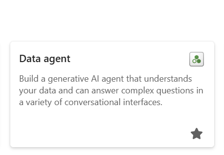
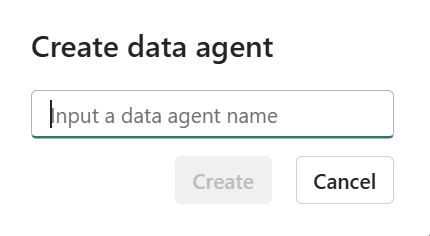
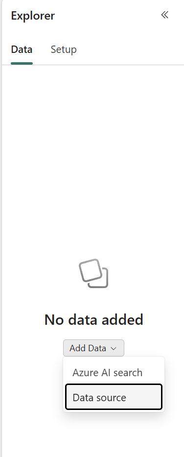
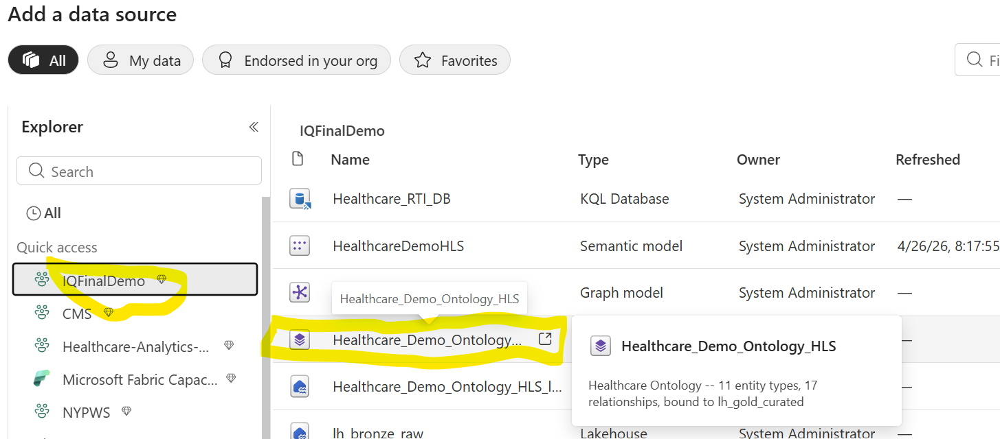
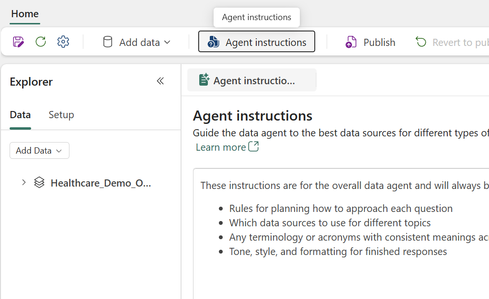

# Fabric-Payer-Provider-HealthCare-Demo

One-click deployment of a complete **Healthcare Payer/Provider Analytics** solution into Microsoft Fabric — no Python install, no `.env` files, no manual setup.

> **The story in one line:** *Same Fabric data foundation, two delivery surfaces — **push** to Microsoft Teams via Data Activator the moment a fraud, readmit-risk, or capacity event fires, and **pull** via the Foundry Orchestrator Agent + Power BI / RTI Dashboard when leaders want to investigate. One governance model, real-time and on-demand.*

> [!IMPORTANT]
> - All data in this demo is **100% synthetic**. No real patient information (PHI) is used.
> - Data was generated using a synthetic data generator with realistic distributions but entirely fictional names and records.
> - This is an **educational demo** showcasing Fabric capabilities. Production healthcare solutions require additional security, compliance (HIPAA/HITECH), and governance controls.

---

## 🎬 Recommended Demo Questions

> **For an easy, story-driven demo that showcases both the Fabric Data Agent and the Foundry IQ Knowledge Agent, ask these two questions back-to-back — same patient, same story.**

1. **In the Fabric Data Agent (`HealthcareHLSAgent`):**
   *"Show me medication adherence for Betty Brown age 83 by drug class."*
   → Returns per-class PDC, gap days, and adherence category from the gold lakehouse.

2. **In the Foundry IQ Knowledge Agent (`HLSAgent`):**
   *"Betty Brown was just discharged after a CHF admission with high readmission risk and is non-adherent on multiple chronic medications. What TCM and MTM interventions should her care team take in the next 7 days? Cite the guidelines."*
   → Returns a cited care plan grounded in the clinical knowledge docs at `lh_gold_curated/Files/healthcare_knowledge/`.

**Why this works:** Q1 shows Fabric's structured-data power; Q2 shows Foundry's reasoning + grounded citations. Together they tell the platform story — *data → decision* — in under 60 seconds.

---

## Table of Contents

1. [Why This Demo? — The Payer & Provider Pain Points](#why-this-demo--the-payer--provider-pain-points)
2. [Quick Start](#quick-start)
3. [What Gets Deployed](#what-gets-deployed)
   - [Data Volumes (Default)](#data-volumes-default)
4. [Architecture](#architecture)
5. [Deployment Flow](#deployment-flow)
   - [What happens when you click "Run All"](#what-happens-when-you-click-run-all)
   - [Deployment Stages Detail](#deployment-stages-detail)
6. [After Deployment](#after-deployment)
   - [Explore the Data](#explore-the-data)
   - [Sample Questions — Data Agents](#sample-questions--data-agents)
   - [Data Agent Reference](#data-agent-reference)
   - [Power BI Dashboard](#power-bi-dashboard)
7. [Real-Time Intelligence (RTI)](#real-time-intelligence-rti--3-payerprovider-use-cases)
   - [Claims Fraud Detection](#use-case-1-claims-fraud-detection)
   - [Care Gap Closure](#use-case-2-care-gap-closure-at-point-of-care)
   - [High-Cost Member Trajectory](#use-case-3-high-cost-member-trajectory)
   - [RTI Data Tables](#rti-data-tables)
   - [RTI Ingestion Architecture](#rti-ingestion-architecture)
8. [Ontology & Graph Model (Automated)](#ontology--graph-model-automated)
9. [Data Agents](#data-agents)
10. [Data Activator / Reflex Setup](#set-up-data-activator-alerts-manual--15-min)
10. [Run Incremental Loads](#run-incremental-loads)
11. [Configuration Options](#configuration-options)
12. [Prerequisites](#prerequisites)
13. [Repository Structure](#repository-structure)
14. [Troubleshooting](#troubleshooting)
15. [Credits](#credits)

---

## Why This Demo? — The Payer & Provider Pain Points

Healthcare payers and providers face compounding operational challenges that erode revenue, increase regulatory risk, and compromise patient outcomes. This demo addresses **six critical pain points** that cost the U.S. healthcare system billions annually:

### 1. Claim Denials Are Draining Revenue

> **Industry average denial rate: 10-15%** — costing a mid-size health system **$4.2M+ per year** in rework, appeals, and lost revenue.

Payers deny claims for preventable reasons: missing documentation (23%), invalid codes (18%), eligibility issues (14%), and prior authorization gaps. Most organizations lack real-time visibility into *which* claims are at risk *before* submission. This demo builds a **denial risk scoring model** that flags high-risk claims proactively, surfaces root causes by payer, and tracks appeal success rates — turning reactive denial management into a predictive workflow.

### 2. Readmissions Drive CMS Penalties

> **CMS Hospital Readmission Reduction Program (HRRP)** penalizes hospitals **up to 3% of total Medicare reimbursement** — for a $450M system, that's **$13.5M at stake**.

30-day readmissions for CHF, COPD, pneumonia, AMI, and TKA/THA are tracked and penalized. Yet most providers lack integrated risk scoring that combines clinical data with social determinants. This demo computes **readmission risk scores** using encounter history, diagnosis complexity, and SDOH factors (food deserts, housing instability, transportation barriers), enabling targeted discharge planning before patients leave the facility.

### 3. Medication Non-Adherence Sinks Star Ratings

> **CMS Star Ratings** triple-weight medication adherence measures (diabetes, RAS antagonists, statins) — making PDC scores the **single largest driver** of plan quality ratings and bonus payments.

Plans with 4+ stars receive significant CMS bonus payments, but adherence gaps are invisible without pharmacy claims integration. This demo calculates **Proportion of Days Covered (PDC)** per patient per drug class, identifies non-adherent members with chronic conditions, and maps adherence gaps to HEDIS measures — giving care managers actionable intervention lists.

### 4. Social Determinants Are Invisible in Clinical Workflows

> **80% of health outcomes** are driven by factors outside the clinic — yet SDOH data rarely appears alongside clinical data.

Zip-code-level poverty rates, food desert flags, transportation scores, housing instability rates, and social vulnerability indices exist in public datasets but aren't integrated into analytics platforms. This demo joins **SDOH data at the zip-code level** to every patient, encounter, and claim — enabling population health stratification, SDOH-informed readmission prevention, and health equity reporting.

### 5. Provider-Payer Contract Complexity Creates Revenue Leakage

> Health systems manage **12+ payer contracts** with different reimbursement rates, PA requirements, timely filing deadlines, and denial behaviors.

Without contract-level analytics, systems can't identify which payers underpay, which deny most frequently, or where network adequacy gaps exist. This demo models **payer-specific analytics** across 12 simulated payers with realistic contract rates, denial patterns, and formulary coverage — revealing collection rate variance and contract negotiation priorities.

### 6. Analytics Teams Can't Stand Up Environments Fast Enough

> Traditional healthcare analytics projects take **weeks to provision** — installing Python, configuring credentials, deploying infrastructure, debugging authentication.

This demo eliminates the entire setup burden. **One notebook, one click, fifteen minutes.** SQL-only analysts, clinical informaticists, and business users can explore a fully functional environment without touching a command line.

### What This Demo Proves

By combining all six dimensions — **claims + readmissions + adherence + SDOH + provider network + quality measures** — in a single Fabric workspace, this demo shows how Microsoft Fabric's unified platform (OneLake, Spark, Direct Lake, Copilot AI) can deliver:

- **Real-time denial risk dashboards** with root cause analysis and appeal tracking
- **Predictive readmission scoring** with SDOH-informed discharge planning
- **HEDIS-aligned medication adherence** monitoring with care gap closure
- **Natural language analytics** via Fabric Data Agent and Azure AI Foundry
- **Ontology-driven knowledge graphs** connecting patients → encounters → claims → providers → payers

All from a single workspace deployed in minutes.

### How this maps to the Microsoft "Healthcare Provider Use Cases" framing

This demo aligns directly with the [Microsoft Healthcare Provider Use Cases](https://microsoft.sharepoint.com/teams/USHealthcareCloudandAIPlatforms/SitePages/Healthcare-Provider-Use-Cases.aspx) playbook. Position it against these solution areas and pain points:

| MS framing | This demo's coverage |
|---|---|
| **Data foundation** (connect data across systems) | ✅ Medallion (Bronze→Silver→Gold) on Fabric/OneLake unifying EHR, claims, ADT, SDOH, pharmacy; ontology + KB sit on top |
| **AI-powered experiences** (summarization, knowledge access, automation) | ✅ Foundry Orchestrator agent with KB grounding + citations; sub-agents for clinical / financial / ops questions |
| **Productivity & collaboration** (care teams, ops, back office) | ✅ Activator → **Teams cards** push the alert into the workflow the user already lives in |
| **Application platform** (targeted solutions, prototypes) | 🟡 Partial — Healthcare_Launcher.ipynb is itself a one-click reusable solution accelerator; complement with custom apps as needed |
| **Operations & analytics** (throughput, RCM, service line, exec decision support) | ✅ Sweet spot — Power BI exec dashboard, RTI Dashboard, fraud/SIU, contract analytics |
| **Care team productivity** (workflow automation, knowledge access, secure collab) | ✅ Real-time Teams alerts + grounded agent answers with citations |
| **Front door & access** (intake, contact center, scheduling) | ❌ Not in scope — complementary to Microsoft Cloud for Healthcare patient experience accelerators |
| **Clinical documentation** (scribe, ambient) | ❌ Not in scope — complementary to Dragon / DAX Copilot |

**The business pain answered:** provider operations are blind to events when they happen and slow to ask *why* when they don't. This demo unifies the data once on Fabric, then delivers the same intelligence two ways — pushed into Teams the instant something fires, and pulled into a grounded AI cockpit when leaders want to investigate.

---

## Quick Start

1. **Create an empty Fabric workspace** (F64+ capacity recommended)
2. **Import** `Healthcare_Launcher.ipynb` into the workspace  
   *(Workspace → Import → Notebook → upload the .ipynb file)*
3. **Run All** — wait ~15-20 minutes

> **That's it — no configuration needed.** The notebook pulls from the public repo `rasgiza/Fabric-Payer-Provider-HealthCare-Demo` by default. If you want to change settings, edit the CONFIG cell before running — for example, set `DEPLOY_STREAMING = True` to enable Real-Time Intelligence (Eventhouse + KQL + scoring), or point `GITHUB_OWNER` to your own fork.
>
> **First deployment** deploys ETL + Agents (Cells 1-11). Set `DEPLOY_STREAMING = True` for the full RTI stack (Cells 12-13).

The launcher creates a deploy lakehouse, downloads the repo, deploys all artifacts in the correct stage order, generates sample data, runs the ETL pipeline, creates the semantic model, deploys the ontology + graph, and patches Data/Graph Agents — fully automated. RTI is opt-in via `DEPLOY_STREAMING = True`.

## What Gets Deployed

| Layer | Items | Description |
|-------|-------|-------------|
| **Lakehouses (4)** | `lh_bronze_raw`, `lh_silver_stage`, `lh_silver_ods`, `lh_gold_curated` | Medallion architecture storage |
| **Notebooks (7)** | 5 ETL + `NB_Generate_Sample_Data` + `NB_Generate_Incremental_Data` | Spark-based data processing |
| **Pipelines (2)** | `PL_Healthcare_Full_Load`, `PL_Healthcare_Master` | Orchestration with full/incremental modes |
| **Semantic Model** | `HealthcareDemoHLS` | Star schema for Power BI (facts + dimensions) |
| **Data Agent** | `HealthcareHLSAgent` | Copilot AI agent — lakehouse + semantic model (SQL aggregations) |
| **Graph Agent** | `Healthcare Ontology Agent` | Copilot AI agent — ontology graph traversal (entity lookups, care pathways) |
| **Ontology** | `Healthcare_Demo_Ontology_HLS` | GraphQL entity model — auto-deployed by Cell 5 (API) |
| **Power BI Report** | `HealthcareAnalyticsDashboard` | 6 pages, 60+ visuals — auto-deployed by fabric-cicd |
| **Eventhouse** ⚡ | `Healthcare_RTI_Eventhouse` | Git-tracked RTI compute engine (`DEPLOY_STREAMING` only) |
| **KQL Database** ⚡ | `Healthcare_RTI_DB` | Git-tracked with schema (6 tables + streaming policies) (`DEPLOY_STREAMING` only) |
| **Eventstream** ⚡ | `Healthcare_RTI_Eventstream` | Custom Endpoint → Eventhouse + Lakehouse + Activator (`DEPLOY_STREAMING` only) |
| **RTI Notebooks (5)** ⚡ | Event Simulator, Setup, 3 Scoring (Fraud, Care Gap, HighCost) | RTI for fraud, care gaps, high-cost trajectory (`DEPLOY_STREAMING` only) |
| **RTI Dashboard** ⚡ | `Healthcare RTI Dashboard` | 4-page KQL dashboard, 30s auto-refresh (`DEPLOY_STREAMING` only) |

> ⚡ = Only deployed when `DEPLOY_STREAMING = True`

### Data Volumes (Default)

| Entity | Rows |
|--------|------|
| Patients | 10,000 |
| Providers | 500 |
| Encounters | 100,000 |
| Claims | 100,000 |
| Prescriptions | ~250,000 |
| Diagnoses | ~200,000 |
| SDOH Zip Codes | ~560 |

## Architecture

Dual-path design: **Batch ETL** (authoritative, historical) + **Real-Time Intelligence** (operational, sub-minute). Batch feeds streaming — Gold dimension tables are the enrichment layer for real-time scoring.

### Solution Architecture


### 🔬 Interactive 3D Ontology Knowledge Graph

**[▶ Launch Interactive 3D Graph](https://rasgiza.github.io/Fabric-Payer-Provider-HealthCare-Demo/docs/ontology_graph_3d.html)** — Explore the full ontology in a cinematic Three.js visualization with bloom lighting, animated data-flow particles, and hover tooltips showing every property and relationship.

| Entities | Relationships | Domains |
|----------|---------------|---------|
| Patient · Provider · Encounter · Diagnosis · PatientDiagnosis · Medication · Prescription · MedicationAdherence · Claim · Payer · CommunityHealth | livesIn · treatedBy · involves · covers · billsFor · submittedBy · prescribedBy · serves · dispenses · originatesFrom · occursIn · references · affects · adherenceFor · adherenceMedication · ClaimHasPayer · PrescriptionHasPayer | Clinical · Financial · Pharmacy · Diagnostic · SDOH |

> *Drag to rotate · Scroll to zoom · Hover nodes for property details*
>
> To run locally: download [`docs/ontology_graph_3d.html`](docs/ontology_graph_3d.html) and open in any browser.

### 🎬 Interactive 3D Patient Story Demos

**[▶ Launch Nancy White Story](https://rasgiza.github.io/Fabric-Payer-Provider-HealthCare-Demo/demo_3d_story/nancy_white_story.html)** — Age 63, Medicare, CHF. 9 drug classes, 8/9 non-adherent, pharmacy desert. How streaming intelligence catches a $42,000 readmission risk in 48 hours instead of 28 days.

**[▶ Launch Sarah Johnson Story](https://rasgiza.github.io/Fabric-Payer-Provider-HealthCare-Demo/demo_3d_story/sarah_johnson_story.html)** — Age 41, Commercial. 13 providers, opioid + benzo FDA black-box combination, 3 psychiatrists, no PCP. How the ontology surfaces an overdose risk that no dashboard can see.

> Navigate with arrow keys, spacebar, click, or number keys. Press **A** for auto-play.

### Detailed Data Flow

```
┌──────────────────────────────────────────────────────────────────────────────┐
│                     HEALTHCARE ANALYTICS ARCHITECTURE                        │
│                     Batch ETL + Real-Time Intelligence                       │
└──────────────────────────────────────────────────────────────────────────────┘

    BATCH PATH (existing)                    STREAMING PATH (new)
    Historical, authoritative,               Operational, sub-minute,
    runs daily / on-demand                   runs continuously
    ─────────────────────────                ────────────────────────

    Source Systems / CSV Gen                 Live Events
    NB_Generate_Sample_Data                  ADT feeds, claims clearinghouse,
    NB_Generate_Incremental_Data             pharmacy PBM, EHR HL7
           │                                          │
           ▼                                          ▼
    ┌──────────────┐                         ┌─────────────────────┐
    │ lh_bronze_raw│                         │ Eventstream         │
    │ (CSV files)  │                         │ (Custom Endpoint)   │
    └──────┬───────┘                         └─────────┬───────────┘
           │                                           │
    01_Bronze_Ingest                              streaming ingestion
           │                                           │
           ▼                                           ▼
    ┌──────────────┐                         ┌─────────────────────┐
    │ lh_silver    │                         │ Healthcare_RTI_DB   │
    │ stage → ODS  │                         │ (KQL Database)      │
    │ (cleansed,   │                         │                     │
    │  enriched)   │                         │ claims_events       │
    └──────┬───────┘                         │ adt_events          │
           │                                 │ rx_events           │
    03_Gold_Star_Schema                      └─────────┬───────────┘
           │                                           │
           ▼                                           │
    ┌──────────────────────┐          reads dims        │
    │   lh_gold_curated    │◄──────────────────────────┤
    │                      │   to enrich events         │
    │ DIMENSIONS (SCD2):   │                            │
    │  dim_patient         │──────────────┐             │
    │  dim_provider        │              │             │
    │  dim_facility        │   reference  │     scoring │
    │  dim_payer           │     data     │             │
    │  dim_diagnosis       │              ▼             ▼
    │  dim_medication      │    ┌──────────────────────────────┐
    │  dim_sdoh            │    │     SCORING NOTEBOOKS         │
    │  care_gaps           │    │                              │
    │  hedis_measures      │    │  NB_RTI_Fraud_Detection      │
    │                      │    │    reads: claims_events      │
    │ FACTS:               │    │    joins: dim_provider,      │
    │  fact_encounter      │    │           fact_claim (hist)  │
    │  fact_claim          │    │    writes: fraud_scores      │
    │  fact_prescription   │    │                              │
    │  fact_diagnosis      │    │  NB_RTI_Care_Gap_Alerts      │
    │                      │    │    reads: adt_events         │
    │ AGGREGATES:          │    │    joins: care_gaps,         │
    │  agg_readmission     │    │           hedis_measures,    │
    │  agg_med_adherence   │    │           dim_patient        │
    │                      │    │    writes: care_gap_alerts   │
    └──────────┬───────────┘    │                              │
               │                │  NB_RTI_HighCost_Trajectory  │
               │                │    reads: claims + adt events│
               │                │    joins: dim_patient         │
               │                │    writes: highcost_alerts   │
               │                └──────────────┬───────────────┘
               │                               │
               ▼                               ▼
    ┌────────────────────┐      ┌──────────────────────────────┐
    │ BATCH CONSUMPTION  │      │ REAL-TIME CONSUMPTION        │
    │                    │      │                              │
    │ Semantic Model     │      │ KQL Dashboard                │
    │ (Direct Lake)      │      │  • Fraud risk heatmap        │
    │                    │      │  • Care gap closure live      │
    │ Data Agent         │      │  • High-cost trend ticker    │
    │ (Copilot AI)       │      │                              │
    │                    │      │ Data Agent                   │
    │ Ontology + Graph   │      │  (queries RTI tables too)    │
    │ (Knowledge Graph)  │      │                              │
    │ Power BI Reports   │      │ Activator (Reflex)           │
    └────────────────────┘      │  • Teams / Email / PA       │
                                └──────────────────────────────┘
```

## Deployment Flow

The launcher notebook (`Healthcare_Launcher.ipynb`) is the post-deployment orchestrator. The Fabric Jumpstart installer creates the workspace items from the repo ahead of time — this notebook then runs the runtime steps that bring the workspace to life.

### What happens when you click "Run All"

| Cell | What It Does |
|------|--------------|
| **0** | Markdown header / welcome |
| **CONFIG** | Set `GITHUB_OWNER`, `DEPLOY_STREAMING`, knowledge-doc / data / pipeline / streaming flags |
| **1** | Upload healthcare knowledge docs from GitHub raw → `lh_gold_curated/Files/healthcare_knowledge/` |
| **2** | Run `NB_Generate_Sample_Data` — ~10K patients, 100K encounters, HEDIS measures |
| **3** | Trigger `PL_Healthcare_Master` with `load_mode=full` — Bronze → Silver → Gold ETL (~8-15 min) |
| **4** | Create & refresh `HealthcareDemoHLS` semantic model (Direct Lake, TMDL) |
| **4b** | Deploy `HealthcareAnalyticsDashboard` Power BI report → bind to refreshed semantic model |
| **5** | Deploy ontology (`Healthcare_Demo_Ontology_HLS`) + auto-provision Graph Model |
| **6** | Patch `HealthcareHLSAgent` datasources with real lakehouse / semantic model IDs |
| **7** ⚡ | Wire RTI Eventstream topology (Custom Endpoint → Eventhouse + Lakehouse + Activator) and create the KQL Dashboard |
| **8** ⚡ | Run RTI pipeline: Setup Eventhouse → Event Simulator → scoring notebooks (Fraud, Care Gap, HighCost). **Requires the Eventstream connection string — see Cell 8 instructions.** |
| **9** | Organize workspace folders + print deployment summary |

> ⚡ = Only runs when `DEPLOY_STREAMING = True`

## After Deployment

### Explore the Data
- Open **lh_gold_curated** → Tables → you'll see star schema tables (fact_encounters, dim_patients, etc.)
- Open **HealthcareDemoHLS** semantic model → create Power BI reports

### Sample Questions — Data Agents

The solution includes two complementary AI agents:

- **HealthcareHLSAgent** — SQL-based agent for aggregations, rates, and trends ("What is the denial rate?", "Top 10 providers by cost")
- **Healthcare Ontology Agent** — Graph traversal agent for entity lookups and relationships ("Tell me about patient PAT0000001", "Who treated this patient?", "Trace claim CLM0009999 from patient to payer")

See **[SAMPLE_QUESTIONS.md](SAMPLE_QUESTIONS.md)** for 90+ copy-paste questions organized by domain and agent — including a top **[Executive Pain-Point Questions](SAMPLE_QUESTIONS.md#executive-pain-point-questions-boardroom--c-suite)** section (CFO, CMO, CMIO, COO, VP Pop Health, CIO) framed in real-world boardroom language.

#### Recommended Demo Warm-Up Sequence (Graph Ontology Agent)

The Graph Data Agent runs on top of an OpenAI assistant thread + tool-call harness. The first 1–2 calls after the agent is published spin up that thread and load the GQL examples from `aiInstructions` into the LLM's working context. Cold-starting straight into a complex aggregation question can surface as `submit_tool_outputs failed` (BadRequest) or "An error occurred". To get reliable demos, **always warm up with two simple list queries first**:

1. `List 5 providers` — confirms the graph is reachable and primes provider entity.
2. `Show me 5 patients` — primes patient entity and adherence relationship.
3. `Which patients have the most non-adherent drug classes?` — the headline aggregation question (uses `MATCH ... FILTER ... LET ... GROUP BY ... ORDER BY ... LIMIT`).
4. Pick a patient from step 3 and drill in: `Show me adherence details for <First> <Last>, age <N>`.

This gives you both reliability (the assistant thread is warm) and a stronger narrative arc (broad → specific → recommendation).

### Data Agent Reference

For the complete agent configuration -- AI instructions, concept-to-table routing, SQL rules, few-shot examples, knowledge base, and customization guide -- see **[DATA_AGENT_GUIDE.md](DATA_AGENT_GUIDE.md)**.

#### Built to Microsoft best practices

`HealthcareHLSAgent` and its `HealthcareDemoHLS` semantic model follow Microsoft's published guidance: **[Semantic model best practices for data agent](https://learn.microsoft.com/en-us/fabric/data-science/semantic-model-best-practices#prep-for-ai-make-semantic-model-ai-ready)** and **[Prepare your data for AI](https://learn.microsoft.com/en-us/power-bi/create-reports/copilot-prepare-data-ai)**.

- **Keep agent instructions cross-source and high-level.** The DAX generation tool ignores data-agent-level instructions when querying a semantic model, so model-specific guidance belongs in **Prep for AI** (AI instructions, AI data schema, verified answers) on the model itself. The agent prompt is kept thin: response formatting, cross-source routing, and tone only. Start lean and add context iteratively.
- **Make the semantic model AI-ready.** Tables, columns, and measures carry descriptions; model-level Prep-for-AI instructions and verified answers are documented for the model owner to apply in the Power BI UI (they can't be set through the agent API).

The copy-paste-ready instructions, verified answers, and the API-vs-UI deployment map are in **[HLS_AGENT_PREP_FOR_AI.md](HLS_AGENT_PREP_FOR_AI.md)**.

##### How the model owner applies Prep for AI (one-time, ~15 min)

**How this is structured:** the steps below are the *click-path* (what to open, in what order);
the actual text and DAX to copy live in **[HLS_AGENT_PREP_FOR_AI.md](HLS_AGENT_PREP_FOR_AI.md)**,
section by section. Follow the steps here and copy from the matching section there.

Git sync deploys the agent prompt and data-source config automatically, but the model-level
**Prep for AI** content can't be set through the API — apply it once by hand:

1. **AI instructions** — In the Fabric/Power BI **service**, open the `HealthcareDemoHLS`
   semantic model → **Prep data for AI** → **Add AI instructions**. Copy the block from
   **Section 3** of **[HLS_AGENT_PREP_FOR_AI.md](HLS_AGENT_PREP_FOR_AI.md)** and paste it in.
2. *(Optional)* **Simplify the data schema** — same pane → deselect fields Copilot doesn't need
   and add synonyms for terms users actually say.
3. **Verified answers** — these are created in **Power BI Desktop**, not the service. Build a
   visual that shows the answer (use the DAX in **Section 4** of
   **[HLS_AGENT_PREP_FOR_AI.md](HLS_AGENT_PREP_FOR_AI.md)** as the spec), then
   **right-click the visual → "Set up verified answer"** and add the phrasings users will ask.
   After you publish/save, the entries appear back in the service under **Prep data for AI →
   Verified answers**.
4. **Re-test and iterate** — start lean; add an instruction or verified answer whenever you
   spot a wrong answer.

### Power BI Dashboard

The **HealthcareAnalyticsDashboard** Power BI report is auto-deployed by fabric-cicd from the `payer-provider-healthcare/HealthcareAnalyticsDashboard.Report/` definition. It includes:

| Page | Focus | Key Visuals |
|------|-------|-------------|
| Executive Summary | KPIs, denial rates, encounter volume | Card KPIs, trend lines, donut charts |
| Claim Denials | Root cause, payer breakdown, financial impact | Waterfall, stacked bar, matrix |
| Readmission Risk | 30-day readmission by facility & diagnosis | Heatmap, scatter, decomposition tree |
| Medication Adherence | PDC rates, non-adherent populations | Gauge, grouped bar, line chart |
| Social Determinants | SDOH risk by zip code, demographics | Map, bar, correlation scatter |
| Provider Performance | Provider metrics, outlier detection | Table, bullet chart, ranking |

The report binds to the `HealthcareDemoHLS` semantic model via Direct Lake (live connection). It starts working as soon as the semantic model refresh completes (Cell 8).

For customization guidance (26 DAX measures, formatting tips, Direct Lake best practices) -- see **[POWERBI_DASHBOARD_GUIDE.md](POWERBI_DASHBOARD_GUIDE.md)**.

### Azure AI Foundry (Optional)

To set up the **Foundry Orchestrator Agent** that combines the Fabric Data Agent with a Knowledge Base (21 clinical documents indexed via Azure AI Search) and web search for hybrid clinical decision support -- see **[FOUNDRY_IQ_SETUP_GUIDE.md](FOUNDRY_IQ_SETUP_GUIDE.md)**.

For troubleshooting hybrid query failures (compound questions, instruction truncation, fewshot phrasing issues) -- see **[FOUNDRY_ORCHESTRATOR_TROUBLESHOOTING.md](FOUNDRY_ORCHESTRATOR_TROUBLESHOOTING.md)**.

---

## Real-Time Intelligence (RTI) — 3 Payer/Provider Use Cases

When `DEPLOY_STREAMING=True`, the launcher deploys a full RTI stack: **Eventhouse + KQL Database + Eventstream + 3 scoring notebooks + RTI Dashboard** that address high-value payer/provider pain points where batch analytics fall short.

**Architecture pattern: hot path / cold path separation.**

| Path | Store | Reader | Latency | Use case |
|------|-------|--------|---------|----------|
| **Hot** | KQL Eventhouse (`Healthcare_RTI_DB`) | KQL Dashboard, Kusto SDK in scoring notebooks | sub-second | Live fraud / care-gap / cost alerts |
| **Cold** | Lakehouse (`lh_gold_curated`) | Power BI Direct Lake on `HealthcareDemoHLS` | minutes | Historical analytics, star schema, agents |

The two stores are queried independently — KQL via the native Kusto query endpoint, Lakehouse via Direct Lake. **OneLake availability on the KQL DB is intentionally NOT enabled** because it would push readers toward Spark/Direct Lake on KQL, which negates the latency advantage that makes RTI valuable. If you need a unified view in your own environment, see *Best Practice vs Demo Approach* below.

### Use Case 1: Claims Fraud Detection

> **$68B lost to healthcare fraud annually** (NHCAA). Most SIU teams investigate claims weeks after submission — by then, the money is gone.

**NB_RTI_Fraud_Detection** scores every claim in real-time using 4 rule-based signals:
- **Velocity burst** — Provider submits many claims within a 1-hour window (30 pts max)
- **Amount outlier** — Claim exceeds 3σ of provider's historical mean (25 pts max)
- **Geographic anomaly** — Patient location far from provider facility (25 pts max)
- **Upcoding** — Consistent use of highest E&M code 99215 (20 pts max)

Risk tiers: **CRITICAL** (≥50) → **HIGH** (≥30) → **MEDIUM** (≥15) → **LOW**

**Output:** `rti_fraud_scores` with lat/long for map visuals showing fraud hotspots.

### Use Case 2: Care Gap Closure at Point of Care

> **Payers spend $2-4 per member per month** on outreach for HEDIS gaps. The highest-value moment is when the patient is *already in front of a provider* — but the care team doesn't know about open gaps.

**NB_RTI_Care_Gap_Alerts** fires when an ADT (Admit/Discharge/Transfer) event arrives:
1. Joins the encounter with the patient's **8 HEDIS measures** (CDC, COL, BCS, SPC, CBP, SPD, OMW, PPC)
2. Checks for open care gaps and ranks by priority (CRITICAL if diabetes/cancer gap >180 days)
3. Generates **human-readable alerts** for the care team at the bedside

**Output:** `rti_care_gap_alerts` with facility lat/long for map visuals showing which facilities have the most gap closure opportunities.

### Use Case 3: High-Cost Member Trajectory

> **5% of members drive 50% of total healthcare costs.** Early identification of members *trending toward* high-cost status enables care management intervention before catastrophic events.

**NB_RTI_HighCost_Trajectory** computes rolling windows over claims and encounters:
- **30-day and 90-day rolling spend** — flags members exceeding $15K/30d or $40K/90d
- **ED superutilizer detection** — ≥3 emergency visits in 30 days
- **Readmission tracking** — multiple admits within 30 days
- **Cost trend** — ACCELERATING / RISING / STABLE / DECLINING

Risk tiers: **CRITICAL** (high spend + frequent ED) → **HIGH** (high spend) → **MEDIUM** (ED/readmit/accelerating) → **LOW**

**Output:** `rti_highcost_alerts` with lat/long for map visuals showing cost hotspots.

### RTI Data Tables

| Table | Description | Rows (Default) |
|-------|-------------|----------------|
| `rti_claims_events` | Simulated claim submissions with fraud patterns | ~500 |
| `rti_adt_events` | ADT events (admit/discharge/transfer) | ~250 |
| `rti_rx_events` | Prescription fill events | ~166 |
| `rti_fraud_scores` | Scored claims with risk tiers and fraud flags | ~500 |
| `rti_care_gap_alerts` | Point-of-care gap closure alerts | varies |
| `rti_highcost_alerts` | Members on escalating cost trajectory | varies |

### RTI Ingestion Architecture

**Eventstream is the front door for all streaming data.** Cell 7 of `Healthcare_Launcher` wires the full Eventstream topology via API. The user copies the connection string from the portal and pastes it into the simulator notebook — then events stream continuously through the entire pipeline.

```
NB_RTI_Event_Simulator
    │
    ▼
Healthcare_RTI_Eventstream (Custom Endpoint — EventHub protocol)
    │
    ├──► Eventhouse / KQL DB          (real-time hot path: KQL Dashboard + scoring notebooks)
    ├──► Lakehouse (lh_bronze_raw)    (raw event archive)
    └──► Activator / Reflex           (fraud / care-gap / high-cost alerts)
```

**Lakehouse** (`lh_gold_curated`) serves as the **batch archive** — populated by the medallion ETL pipeline, not by streaming. The KQL Eventhouse is the real-time query engine; the Lakehouse gold layer is the historical analytics engine. Each serves its optimal workload.

#### Best Practice vs Demo Approach

| Aspect | Production Best Practice | This Demo |
|--------|--------------------------|-----------|
| **Unified access** | Enable OneLake Availability on KQL DB → create OneLake shortcuts in Lakehouse pointing to KQL tables → query both stores via one semantic model | KQL Eventhouse for real-time; Lakehouse for batch — queried separately |
| **Why the difference** | OneLake shortcuts require manual "Enable OneLake Availability" in the portal, propagation delays (30-60s), and specific table format requirements that don't lend themselves to one-click automation | Demo prioritizes reliability and zero manual portal steps over unified access |
| **Trade-off** | Unified lakehouse view of both batch + streaming tables | Two query surfaces: KQL for streaming, Spark SQL for batch — both are fully functional |

> **To enable shortcuts in your own environment (recommended for production):**
> 1. Open your **KQL Database** in the Fabric portal
> 2. Click **Database details** → toggle **OneLake availability** to **Active**
> 3. Wait ~60 seconds for propagation
> 4. In your Lakehouse → **New shortcut** → **Microsoft OneLake** → select the KQL database → choose tables
> 5. Streaming tables now appear as Delta tables in the Lakehouse alongside batch gold tables

**How to start streaming (1 manual step — unavoidable):**

Fabric does not expose Eventstream Custom Endpoint connection strings via REST API, so the simulator notebook must be given the connection string by hand. This is the only manual step in the entire deployment.

1. Cell 7 of `Healthcare_Launcher` wires the Eventstream topology and prints the URL
2. Open **Healthcare_RTI_Eventstream** in the Fabric portal
3. Click the **HealthcareCustomEndpoint** source node → copy the **Connection String**
4. Open **NB_RTI_Event_Simulator** → paste into `ES_CONNECTION_STRING`
5. Run **Cell 8** of `Healthcare_Launcher` → it runs the simulator + all 3 scoring notebooks (`NB_RTI_Fraud_Detection`, `NB_RTI_Care_Gap_Alerts`, `NB_RTI_HighCost_Trajectory`) automatically
6. Re-run any scoring notebook directly anytime to reprocess the live KQL data

> The user can re-run the simulator and scoring notebooks anytime to generate and process fresh data.

#### API vs Portal Capabilities

| Action | API | Portal |
|---|---|---|
| Create Eventstream item | ✅ Done by Cell 7 | ✅ |
| Add Custom Endpoint source | ✅ Done by Cell 7 (definition API) | ✅ |
| Wire Eventhouse destination | ✅ Done by Cell 7 (definition API) | ✅ |
| Wire Lakehouse destination | ✅ Done by Cell 7 (if lh_bronze_raw exists) | ✅ |
| Wire Activator/Reflex destination | ✅ Done by Cell 7 (if Reflex item exists) | ✅ |
| Configure stream routing | ✅ Done by Cell 7 (definition API) | ✅ |
| **Get connection string** | ❌ Not exposed in API schema | ✅ Portal only |
| Verify topology status | ✅ GET /topology endpoint | ✅ |

### Data Agents

The **HealthcareHLSAgent** (SQL agent) is deployed programmatically by the launcher — no manual setup required. It connects to the `HealthcareDemoHLS` semantic model and includes AI instructions and data source configuration automatically.

To test it, open the agent in your workspace and try a sample question:
- *"What is the overall denial rate by payer?"*
- *"Show me the top 10 providers by total billed amount"*
- *"Which patients have the highest readmission risk?"*

See **[SAMPLE_QUESTIONS.md](SAMPLE_QUESTIONS.md)** for 80+ tested questions across all domains.

#### Data Agent — Ontology As Source

The **HealthcareHLSOntology Agent** (graph agent) must be created manually in the Fabric UI — it cannot be fully deployed via API.

**Step 1: Create the Agent**

1. In your workspace → **+ New item** → **Data agent**

   

2. Name it `HealthcareHLSOntology Agent` → click **Create**

   

**Step 2: Add the Data Source**

1. Click **Add Data** → **Data source**

   

2. Browse to your workspace → select the ontology **`Healthcare_Demo_Ontology_HLS`** (Graph model)

   

3. The agent will connect to the graph model (12 entities, 18 relationships)

**Step 3: Configure AI Instructions**

1. Click **Agent instructions** (top toolbar)

   

2. Copy the AI instructions text from **[DATA_AGENT_INSTRUCTIONS.md → Section 2a](DATA_AGENT_INSTRUCTIONS.md#2-healthcare-ontology-agent-graph-agent)** — AI Instructions
3. Paste into the instructions text box → click **Apply**

> These instructions tell the agent about the ontology entities, relationships, and graph traversal patterns for healthcare queries.

**Step 4: Test the Agent**

1. In the agent chat panel, try a sample question:
   - *"Which providers treat patients covered by Aetna?"*
   - *"Show the care pathway for patient P-1001"*
   - *"What prescriptions are linked to claims denied for medical necessity?"*
2. See **[SAMPLE_QUESTIONS.md → Graph Agent](SAMPLE_QUESTIONS.md#graph-agent-healthcare-ontology-agent)** section for more questions

---

### Set Up Data Activator Alerts (Manual — ~15 min)

Data Activator (Reflex) is the **production-grade alerting layer** for this solution. It monitors RTI KQL tables in real time and fires **proactive alerts** via Email, Teams, or Power Automate when scoring thresholds are breached — no code required.

> **Why Activator?** In real-world healthcare operations, compliance and audit teams need **deterministic, rule-based alerts** that fire consistently and can be traced back to exact thresholds. Activator provides this with built-in deduplication, configurable cadence, and direct integration with Teams/Email/Power Automate — making it the operational backbone for:
> - **Fraud SIU teams** receiving immediate referrals when anomaly scores spike
> - **Care coordinators** getting notified of overdue HEDIS gaps when patients are admitted
> - **Case managers** flagged on high-cost member trajectories before costs escalate
> - **IT/ops teams** alerted to pipeline staleness or data quality issues

#### Step 1: Create a Reflex Item

1. In your Fabric workspace → **+ New item** → **Reflex**
2. Name it `Healthcare_RTI_Alerts`

#### Step 2: Connect to the KQL Database

1. In the Reflex item → **Get data** → **KQL Database**
2. Select `Healthcare_RTI_DB` (in the `Healthcare_RTI_Eventhouse`)
3. You'll add triggers for each of the 3 scoring tables below

#### Step 3: Configure Alert Rules

**Rule 1 — Fraud Detection (SIU Referral)**

| Setting | Value |
|---------|-------|
| **Table** | `fraud_scores` |
| **Monitor** | `fraud_score` |
| **Condition** | `fraud_score >= 50` |
| **Action 1** | **Email** → notify SIU team |
| **Action 2** | **Teams** → post to `#fraud-investigations` channel (optional) |
| **Card fields** | claim_id, patient_id, provider_id, fraud_score, fraud_flags, risk_tier |
| **Email Subject** | `🚨 CRITICAL Fraud Alert — SIU Referral: Patient {{patient_id}}` |
| **Email Body** | `Claim {{claim_id}}, Score {{fraud_score}}, Flags: {{fraud_flags}}` |

**Rule 2 — Care Gap Outreach (Overdue HEDIS Gaps)**

| Setting | Value |
|---------|-------|
| **Table** | `care_gap_alerts` |
| **Monitor** | `gap_days_overdue` |
| **Condition** | `gap_days_overdue > 90` |
| **Action 1** | **Email** → notify care coordinator |
| **Action 2** | **Teams** → post to `#care-coordination` channel (optional) |
| **Card fields** | patient_id, measure_name, gap_days_overdue, alert_priority, alert_text |
| **Email Subject** | `⚠️ Care Gap Alert — {{measure_name}}: Patient {{patient_id}}` |
| **Email Body** | `{{gap_days_overdue}} days overdue, Priority: {{alert_priority}}` |

**Rule 3 — High-Cost Member (Care Management Referral)**

| Setting | Value |
|---------|-------|
| **Table** | `highcost_alerts` |
| **Monitor** | `rolling_spend_30d` |
| **Condition** | `rolling_spend_30d > 50000` |
| **Action 1** | **Email** → notify case manager |
| **Action 2** | **Power Automate** → trigger care management workflow (optional) |
| **Card fields** | patient_id, rolling_spend_30d, ed_visits_30d, cost_trend, risk_tier |
| **Email Subject** | `💰 High-Cost Alert — Patient {{patient_id}}: ${{rolling_spend_30d}} in 30d` |
| **Email Body** | `ED Visits: {{ed_visits_30d}}, Trend: {{cost_trend}}, Tier: {{risk_tier}}` |

#### Step 4: Verify Alerts Fire

1. Run **NB_RTI_Event_Simulator** in batch mode to generate test events
2. Run the 3 scoring notebooks (Fraud, Care Gap, HighCost)
3. Check your Teams channel / email for alert cards within ~60 seconds

> **Power Automate integration**: For complex routing (create ServiceNow tickets, update EHR systems, page on-call staff), select **Power Automate** as the action and build a flow that reads the alert payload. The Reflex trigger passes all card fields as dynamic content to the flow.

#### Real-World Pain Points Solved

| Pain Point | How Activator Solves It |
|------------|------------------------|
| **Fraud goes undetected for days** | Fraud scores ≥ 50 trigger immediate SIU email — MTTD drops from days to minutes |
| **Care gaps missed during admissions** | Patients with overdue HEDIS measures are flagged on admission — care coordinators act while the patient is still in-house |
| **High-cost members escalate silently** | Spending trajectories > $50K/30d trigger proactive case management before costs spiral |
| **Alert fatigue from noisy dashboards** | Activator fires only when thresholds breach — no polling, no dashboards to watch |
| **Compliance audit trail gaps** | Every Activator trigger is logged with timestamp, threshold, and action taken — ready for audit |

### Run Incremental Loads

After the initial full load, you can simulate daily operational data arriving. The pipeline supports a `load_mode` parameter that switches between full rebuild and incremental processing.

#### How It Works

The **PL_Healthcare_Master** pipeline accepts a `load_mode` parameter (default `"full"`). When set to `"incremental"`, the pipeline:

1. **Generates new data** — runs `NB_Generate_Incremental_Data` to create today's records
2. **Bronze: APPEND** — new CSVs are appended to existing Bronze tables (not overwritten), then archived to `Files/processed/` to prevent duplicate reads
3. **Silver: Full rebuild** — Silver notebooks always read all Bronze data, clean, deduplicate, and overwrite Silver tables (idempotent)
4. **Gold: MERGE** — Gold uses Delta Lake merge operations:
   - **SCD Type 2 dimensions** (`dim_patient`, `dim_provider`): detects attribute changes (city, state, zip, specialty, department), expires old versions (`is_current=0`), and inserts new versions with new surrogate keys
   - **Type 1 dimensions** (`dim_payer`, `dim_facility`, `dim_diagnosis`, `dim_medication`): overwritten (reference data, no history needed)
   - **Fact tables** (`fact_encounter`, `fact_claim`, `fact_prescription`): Delta MERGE on business key — updates existing rows, inserts new ones

#### Data Volumes Per Incremental Run

| Entity | New Rows | Notes |
|--------|----------|-------|
| Encounters | ~50 | All dated today |
| Claims | ~50 | One per encounter |
| Diagnoses | ~100–150 | 1 principal + 0–2 secondary per encounter |
| Prescriptions | ~75–100 | 1–3 per encounter based on diagnosis |
| Patients | ~2 new + 2–3 updates | Updates simulate address/insurance changes |

#### Steps

**Option A — Run from the Pipeline UI:**

1. Open **PL_Healthcare_Master** in your Fabric workspace
2. Click **Run** → set parameter `load_mode` = `incremental`
3. Wait ~10–12 minutes for the pipeline to complete

**Option B — Run the notebooks manually:**

1. Open **NB_Generate_Incremental_Data** → Run All  
   *(writes timestamped CSVs to `Files/incremental/YYYY-MM-DD/`)*
2. Open **PL_Healthcare_Full_Load** → Run with parameter `load_mode=incremental`  
   *(or run Bronze → Silver → Gold notebooks individually)*

#### Scheduling

To automate daily incremental loads, add a **Schedule trigger** to `PL_Healthcare_Master`:

1. Open the pipeline → **Schedule** (top toolbar)  
2. Set recurrence (e.g., daily at 6:00 AM)  
3. Add parameter: `load_mode` = `incremental`

#### Verifying Incremental Data

After an incremental run, check that new data flowed through:

```sql
-- Gold layer: count should increase by ~50 per run
SELECT COUNT(*) FROM lh_gold_curated.fact_encounter

-- SCD2: check for expired patient versions
SELECT patient_id, city, is_current, effective_end_date
FROM lh_gold_curated.dim_patient
WHERE is_current = 0
ORDER BY effective_end_date DESC
LIMIT 10
```

Repeat daily to build up a realistic data history showing trends over time in the Power BI dashboard.

## Configuration Options

Edit the top cell of `Healthcare_Launcher.ipynb`:

| Variable | Default | Description |
|----------|---------|-------------|
| `GITHUB_OWNER` | `rasgiza` | GitHub org or username (public repo — no token needed) |
| `GITHUB_REPO` | `Fabric-Payer-Provider-HealthCare-Demo` | Repository name |
| `GITHUB_BRANCH` | `main` | Branch to deploy from |
| `GITHUB_TOKEN` | `""` | Only needed if you fork to a private repo |
| `GENERATE_DATA` | `True` | Generate fresh synthetic data |
| `RUN_PIPELINE` | `True` | Run the full-load pipeline |
| `UPLOAD_KNOWLEDGE_DOCS` | `True` | Upload knowledge docs for AI agent |
| `DEPLOY_STREAMING` | `False` | Deploy Real-Time Intelligence (Eventhouse + KQL + Eventstream + 3 scoring notebooks + RTI Dashboard). Set `True` for RTI. |
| `ES_CONNECTION_STRING` | `""` | *(In NB_RTI_Event_Simulator)* Eventstream Custom Endpoint connection string. Required for streaming \u2014 copied from the portal after Eventstream is provisioned. |

> **Restricted networks:** The launcher downloads from GitHub at runtime. If your environment blocks `github.com` or `raw.githubusercontent.com`, fork this repo to an allowed internal location and update `GITHUB_OWNER` / `GITHUB_REPO` accordingly.

## Prerequisites

- **Microsoft Fabric** workspace with **F64** or higher capacity
- User must be workspace **Admin** or **Member**
- Workspace should be **empty** (the launcher checks for this)
- Internet access to download from GitHub

## Repository Structure

```
├── Healthcare_Launcher.ipynb          # <- Import this into Fabric
├── DATA_AGENT_GUIDE.md                # Agent instructions, routing, few-shots, knowledge base
├── POWERBI_DASHBOARD_GUIDE.md         # Power BI report pages, measures, Direct Lake tips
├── FOUNDRY_IQ_SETUP_GUIDE.md          # Azure AI Foundry orchestrator agent setup (11 steps)
├── FOUNDRY_ORCHESTRATOR_TROUBLESHOOTING.md  # Hybrid query debugging guide
├── foundry_agent/
│   └── orchestrator_instructions.md   # Version-controlled orchestrator instructions (v23)
├── SAMPLE_QUESTIONS.md                # 80+ copy-paste questions for all agents
├── deployment.yaml                    # Optional: CI/CD config
├── README.md
├── payer-provider-healthcare/         # Fabric Git Integration format (jumpstart workspace_path)
│   ├── lh_bronze_raw.Lakehouse/
│   ├── lh_silver_stage.Lakehouse/
│   ├── lh_silver_ods.Lakehouse/
│   ├── lh_gold_curated.Lakehouse/
│   ├── 01_Bronze_Ingest_CSV.Notebook/
│   ├── 02_Silver_Stage_Clean.Notebook/
│   ├── 03_Silver_ODS_Enrich.Notebook/
│   ├── 06a_Create_Gold_Lakehouse_Tables.Notebook/
│   ├── 06b_Gold_Transform_Load_v2.Notebook/
│   ├── NB_Generate_Sample_Data.Notebook/
│   ├── NB_Generate_Incremental_Data.Notebook/
│   ├── NB_RTI_Event_Simulator.Notebook/
│   ├── NB_RTI_Setup_Eventhouse.Notebook/
│   ├── NB_RTI_Fraud_Detection.Notebook/
│   ├── NB_RTI_Care_Gap_Alerts.Notebook/
│   ├── NB_RTI_HighCost_Trajectory.Notebook/
│   ├── PL_Healthcare_Full_Load.DataPipeline/
│   ├── PL_Healthcare_Master.DataPipeline/
│   ├── HealthcareDemoHLS.SemanticModel/
│   ├── HealthcareHLSAgent.DataAgent/
│   └── Healthcare Ontology Agent.DataAgent/
├── ontology/                          # Ontology manifest (12 entities, 18 relationships) — deployed by Cell 10a
│   └── Healthcare_Demo_Ontology_HLS/
├── healthcare_knowledge/              # AI agent knowledge base
│   ├── clinical_guidelines/
│   ├── compliance/
│   ├── denial_management/
│   ├── formulary/
│   ├── provider_network/
│   └── quality_measures/
└── scripts/                           # Build tools (not deployed)
    └── convert_from_source.py
```

## Troubleshooting

| Issue | Solution |
|-------|----------|
| "Workspace is not empty" | The Jumpstart installer expects an empty workspace before deploying items |
| Pipeline fails | Open PL_Healthcare_Master → check activity run details. Common cause: lakehouse tables not yet created |
| Semantic model shows no data | Run the pipeline first — it populates Gold lakehouse tables that the model reads |
| Data Agent returns generic answers | Open the agent → verify AI instructions are pasted from [DATA_AGENT_INSTRUCTIONS.md § 1a](DATA_AGENT_INSTRUCTIONS.md#1a--ai-instructions-stage_configjson) and data source is connected |
| Graph Agent shows no results | Re-run Cell 5 of `Healthcare_Launcher` (deploys ontology + graph) and Cell 6 (patches agent IDs) |
| RTI tables stay empty | Confirm `ES_CONNECTION_STRING` was pasted into Cell 8 — the Eventstream Custom Endpoint key is required for ingestion |

## Credits

Built with:
- [fabric-cicd](https://pypi.org/project/fabric-cicd/) for artifact deployment
- Synthetic data generated with [Faker](https://faker.readthedocs.io/)
