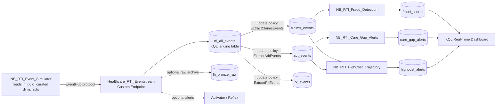

# Real-Time Intelligence (RTI) Streaming Guide

## Overview

This guide covers the Real-Time Intelligence (RTI) streaming scenario in the Healthcare Demo.
The RTI stack adds a **real-time hot path** on top of the batch medallion: healthcare events are
scored **as they arrive** so the demo can drive intervention *before* it is too late.

It complements the batch side (medallion → Direct Lake report → Data Agent), which answers
*"what happened"* on historical data. RTI answers *"what is happening right now, and what should I do
about it."*

Everything is deployed and run from the **Healthcare Launcher** — no portal clicks are required for the
core scenario. OneLake Availability is **optional** (see [Optional: OneLake Availability](#optional-onelake-availability)).

---

## The three business use cases

| # | Use case | Industry pain point it solves |
|---|----------|-------------------------------|
| 1 | **Claims Fraud Detection** | Catch fraud at submission time, not in a post-pay audit months later |
| 2 | **Care Gap Closure at Point of Care** | Close HEDIS gaps while the patient is *physically in front of a provider* (lifts closure ~30% → 60%+) |
| 3 | **High-Cost Member Trajectory** | Flag members escalating toward catastrophic spend *before* the ICU admission (5% of members drive ~50% of cost) |

---

## Architecture



**Key architectural facts (v1.0.12):**

- **Scoring notebooks read KQL directly via the Kusto SDK** (`azure-kusto-data` / `KustoClient`) — native
  real-time query against the typed tables. They do **not** read OneLake shortcuts or Spark Delta tables for
  the streaming events.
- **Update policies run server-side and are deployed programmatically** by `NB_RTI_Setup_Eventhouse`. They
  fire on every ingestion batch into `rti_all_events`, fanning rows out to the typed tables by the `_table`
  field. No portal step is required to make them fire.
- **OneLake Availability is intentionally NOT enabled** for the core scenario, because mirroring KQL → Delta
  adds latency that negates the real-time advantage. It is available as an optional step if you want unified
  lakehouse/Spark access to the KQL tables.
- **No orchestration pipeline.** The Launcher cell drives the run directly via `notebookutils.notebook.run`.

---

## What gets deployed

The `05_Real_Time_Intelligence/` folder contains the following Fabric items.

| Artifact | Type | Purpose |
|----------|------|---------|
| `Healthcare_RTI_Eventhouse` | Eventhouse | Hosts the KQL database (real-time compute) |
| `Healthcare_RTI_DB` | KQL Database | 7 KQL tables (1 landing + 3 typed input + 3 scored output) |
| `Healthcare_RTI_Eventstream` | Eventstream | Created/wired at runtime; routes Custom Endpoint events → KQL (+ optional Lakehouse / Activator) |
| `NB_RTI_Setup_Eventhouse` | Notebook | Creates KQL tables, streaming ingestion policies, update policies, JSON mappings, mirroring policies |
| `NB_RTI_Event_Simulator` | Notebook | Generates realistic streaming claims / ADT / Rx events from gold dims & facts |
| `NB_RTI_Fraud_Detection` | Notebook | Use Case 1 — scores claims for fraud risk |
| `NB_RTI_Care_Gap_Alerts` | Notebook | Use Case 2 — checks ADT arrivals against open HEDIS gaps |
| `NB_RTI_HighCost_Trajectory` | Notebook | Use Case 3 — rolling 30d/90d spend + ED-visit analysis |
| `Healthcare RTI Dashboard` | KQL Real-Time Dashboard | Real-time tiles over the scored output tables |

---

## KQL tables

`NB_RTI_Setup_Eventhouse` creates all 7 tables via `.create-merge` (idempotent), then applies streaming
ingestion policies, update policies, JSON ingestion mappings, and 5-minute mirroring policies.

### Landing table

| Table | Role |
|-------|------|
| `rti_all_events` | All simulator events land here first (string-typed timestamp + a `_table` routing field). Update policies fan rows out to the typed tables. |

### Typed input tables (populated by update policies)

| Table | Events | Key fields |
|-------|--------|-----------|
| `claims_events` | Claims submissions | `claim_id`, `patient_id`, `provider_id`, `claim_amount`, `injected_fraud_flags`, lat/long |
| `adt_events` | Admit / Discharge / Transfer | `patient_id`, `facility_id`, `admission_type`, `has_open_care_gaps`, `open_gap_measures` |
| `rx_events` | Prescription fills | `patient_id`, `medication_code`, `drug_class`, `quantity`, `days_supply` |

### Scored output tables (written by scoring notebooks)

| Table | Scores | Key fields |
|-------|--------|-----------|
| `fraud_scores` | Fraud risk per claim | `fraud_score` (0–100), `risk_tier`, `fraud_flags` |
| `care_gap_alerts` | Care-gap notifications | `measure_id`, `gap_days_overdue`, `alert_priority`, `alert_text` |
| `highcost_alerts` | High-cost member flags | `rolling_spend_30d` / `rolling_spend_90d`, `ed_visits_30d`, `cost_trend`, `risk_tier` |

The update policies are implemented as KQL functions (`ExtractClaimsEvents()`, `ExtractAdtEvents()`,
`ExtractRxEvents()`) that filter `rti_all_events` by `_table`, convert the string `event_timestamp` to
`datetime`, and coalesce columns that may be null in the landing table.

---

## How it runs (Launcher)

The RTI scenario runs from two cells in the **Healthcare Launcher**, gated by `DEPLOY_STREAMING` in the
CONFIG cell.

### CELL 5 — Deploy RTI streaming topology

- Deploys the Eventhouse + KQL Database (from Git artifacts).
- Creates the Eventstream and **wires the topology via REST**: Custom Endpoint source → KQL destination
  (+ optional Lakehouse archive / Activator).
- Deploys the **KQL Real-Time Dashboard** via REST.
- Prints an informational banner. OneLake Availability is called out as **optional** — nothing is required
  to continue.

### CELL 6 — Run the RTI streaming pipeline

1. **Auto-fetches the Eventstream Custom Endpoint connection string** via
   `GET /eventstreams/{id}/sources/{sourceId}/connection` (no portal copy/paste). You can override by pasting
   a value into `ES_CONNECTION_STRING`.
2. **Step 0** — runs `NB_RTI_Setup_Eventhouse` (creates the 7 tables, streaming + update + mirroring policies,
   JSON mappings).
3. **Step 1** — runs `NB_RTI_Event_Simulator` with `STREAM_BATCHES=10`; events flow to the Eventstream and land
   in `rti_all_events`, then update policies route them into the typed tables.
4. **Step 2** — verifies data landed by polling `claims_events`, `adt_events`, `rx_events` (`| count`) up to
   12 × 10s.
5. **Step 3** — runs the three scoring notebooks (`NB_RTI_Fraud_Detection`, `NB_RTI_Care_Gap_Alerts`,
   `NB_RTI_HighCost_Trajectory`). Each reads its typed table(s) via the Kusto SDK, scores, and writes results
   to the KQL output table(s) **and** a Delta copy (`rti_fraud_scores`, etc.) in `lh_gold_curated`.

> The Launcher tolerates the known Fabric `mssparkutilsrun-result+json` / `NoSuchElementException`
> result-parse quirk and treats those child-notebook runs as successful.

---

## Data flow summary

| Step | Source | Destination | Mechanism |
|------|--------|-------------|-----------|
| Simulator → Eventstream | Generated events | Eventstream Custom Endpoint | EventHub SDK (`azure-eventhub`) |
| Eventstream → KQL | Eventstream | `rti_all_events` (landing table) | Eventstream KQL destination |
| Landing → typed tables | `rti_all_events` | `claims_events`, `adt_events`, `rx_events` | KQL update policies (server-side, automatic) |
| Scoring READ | typed KQL tables | scoring notebooks | **Kusto SDK** (`azure-kusto-data`, direct query) |
| Scoring WRITE (real-time) | scored results | `fraud_scores`, `care_gap_alerts`, `highcost_alerts` (KQL) | Kusto ingestion (`azure-kusto-ingest`) |
| Scoring WRITE (analytics) | scored results | `rti_fraud_scores`, … (Delta in `lh_gold_curated`) | `saveAsTable` |
| Dashboard | KQL output tables | Real-Time Dashboard tiles | Native KQL query (auto-refresh) |

---

## Setup steps (new user after cloning)

### Prerequisites

- Healthcare Launcher batch cells completed (lakehouses, notebooks, data deployed).
- `DEPLOY_STREAMING = True` in the CONFIG cell.
- Fabric capacity **active** (F4 minimum; **F16+** recommended if you run streaming alongside the Data Agent,
  Foundry agent, and Direct Lake reports during a live demo — concurrent load can throttle smaller SKUs).

### Run it

1. **Run CELL 5** — deploys the Eventhouse, KQL DB, Eventstream topology, and Real-Time Dashboard.
2. **Run CELL 6** — auto-fetches the connection string, sets up the KQL schema, streams events, verifies, and
   runs the three scoring notebooks.

That's it — no portal step is required. Under **Run All**, both cells execute in sequence.

> **Fallback if the connection string auto-fetch fails:** open **Healthcare_RTI_Eventstream** →
> **HealthcareCustomEndpoint** in the portal, copy the **Connection String** (includes EntityPath), paste it
> into `ES_CONNECTION_STRING` in CELL 6, and re-run the cell.

---

## Why direct Kusto ingestion + server-side update policies

The Fabric REST API cannot fully configure the Eventstream → Eventhouse OAuth2 (Kusto) connection
programmatically. Rather than require a portal click to "fix" the destination, this demo:

- lands events in `rti_all_events` and uses **server-side update policies** to populate the typed tables
  (these fire automatically on every ingestion batch — no connection mode toggle needed), and
- has `NB_RTI_Setup_Eventhouse` use **direct Kusto ingestion** (`azure-kusto-ingest`) where it needs to seed
  or backfill tables.

The result is a streaming scenario that deploys and runs end-to-end with zero portal clicks.

---

## Optional: OneLake Availability

By default, the KQL tables are queried natively (Kusto SDK / KQL Dashboard) and OneLake Availability is **not**
enabled — this preserves the sub-second latency that makes RTI valuable. The mirroring policies set by
`NB_RTI_Setup_Eventhouse` (`TargetLatencyInMinutes=5`) only take effect **if** you enable OneLake Availability.

Enable it only if you want to read the KQL tables as Delta from Spark / the lakehouse:

1. Open **Healthcare_RTI_DB** in the Fabric portal.
2. **Database details** → **OneLake** section → set **Availability** → **Enabled**.
3. Check **"Apply to existing tables"** → confirm.

After ~5 minutes (the mirroring policy latency), the KQL tables are available as Delta in OneLake, and you can
create shortcuts in `lh_gold_curated` to read them with `spark.table()`.

> **Why is this a portal-only step?** OneLake Availability has no public REST API or KQL command to enable it
> programmatically as of mid-2026 — hence it is left as an explicit, optional toggle.

---

## Troubleshooting

### Typed tables (`claims_events` / `adt_events` / `rx_events`) are empty but `rti_all_events` has data

The update policies route by the `_table` field. Verify they exist and are enabled:

```kql
.show table claims_events policy update
.show table adt_events policy update
.show table rx_events policy update
```

If missing, re-run `NB_RTI_Setup_Eventhouse` (CELL 6 Step 0). Confirm the simulator tagged events with a
`_table` value (`rti_all_events | summarize count() by _table`).

### Scoring notebooks fail with "Eventhouse not found" / no `queryServiceUri`

`NB_RTI_Setup_Eventhouse` must run first (it discovers the Eventhouse query URI). Re-run CELL 6 from Step 0.

### No data in KQL after the simulator runs

1. Confirm CELL 6 auto-fetched (or you pasted) a valid `ES_CONNECTION_STRING`.
2. Open **Healthcare_RTI_Eventstream** → **HealthcareCustomEndpoint**; ensure the source status is **Created**.
3. Check `rti_all_events | count` in KQL — if it is non-zero but typed tables are empty, see the update-policy
   section above.

### Fabric "result-parse" error on a child notebook (`mssparkutilsrun-result+json` / `NoSuchElementException`)

This is a known Fabric quirk in `notebookutils.notebook.run`. The Launcher already treats it as success; the
child notebook actually completed. If you run a notebook manually, ignore this specific error.

### Capacity not active

All Fabric operations (topology push, notebook runs, KQL queries) require an active capacity. Resume it from
the Azure Portal → your Fabric capacity resource → **Resume**.

---

## Relationship to the batch side

| Store | Path | Query surface | Purpose |
|-------|------|---------------|---------|
| **KQL Eventhouse** (`Healthcare_RTI_DB`) | Hot / real-time | Kusto SDK, KQL Real-Time Dashboard | Score events as they arrive; drive point-of-care / point-of-submission action |
| **Gold Lakehouse** (`lh_gold_curated`) | Batch / historical | Direct Lake report, Data Agent | Star-schema analytics, "what happened" |

The two stores are queried independently. The scoring notebooks also persist a Delta copy of their results in
the gold lakehouse so historical and real-time views stay reconcilable.
