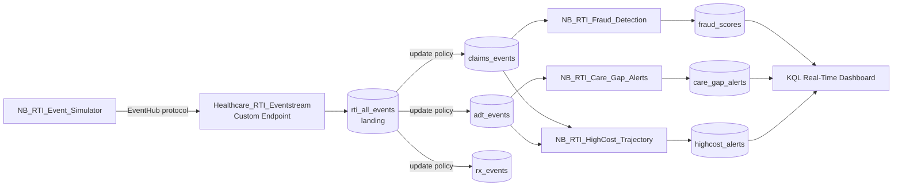

# 05 — Real-Time Intelligence (RTI)

Real-time **hot path** for the Healthcare Demo. Scores healthcare events **as they arrive** to drive
intervention before it is too late — complementing the batch medallion (which answers *"what happened"*).

Full walkthrough, KQL table schemas, setup steps, and troubleshooting:
**[../RTI_STREAMING_GUIDE.md](../RTI_STREAMING_GUIDE.md)**.

## Three business use cases

| # | Use case | Notebook | Industry pain point |
|---|----------|----------|---------------------|
| 1 | Claims Fraud Detection | `NB_RTI_Fraud_Detection` | Catch fraud at submission, not in a post-pay audit |
| 2 | Care Gap Closure at Point of Care | `NB_RTI_Care_Gap_Alerts` | Close HEDIS gaps while the patient is in front of a provider |
| 3 | High-Cost Member Trajectory | `NB_RTI_HighCost_Trajectory` | Flag escalating members before catastrophic spend |

## Flow

Scoring notebooks read the typed KQL tables **directly via the Kusto SDK** (`azure-kusto-data`). Update
policies (server-side) fan `rti_all_events` out to the typed tables automatically — no portal step.
OneLake Availability is **optional**.

## Contents

| Item | Type | Purpose |
|------|------|---------|
| `Healthcare_RTI_Eventhouse` | Eventhouse | Hosts the KQL database |
| `Healthcare_RTI_DB` | KQL Database | 7 tables: `rti_all_events` + 3 typed input + 3 scored output |
| `NB_RTI_Setup_Eventhouse` | Notebook | Creates tables, streaming + update + mirroring policies, JSON mappings |
| `NB_RTI_Event_Simulator` | Notebook | Generates streaming claims / ADT / Rx events from gold dims & facts |
| `NB_RTI_Fraud_Detection` | Notebook | Use Case 1 |
| `NB_RTI_Care_Gap_Alerts` | Notebook | Use Case 2 |
| `NB_RTI_HighCost_Trajectory` | Notebook | Use Case 3 |

## Run it

Driven by the **Healthcare Launcher** (gated by `DEPLOY_STREAMING = True`):

- **CELL 5** — deploy Eventhouse + KQL DB + Eventstream topology + Real-Time Dashboard.
- **CELL 6** — auto-fetch the connection string → run Setup → stream events → verify → run the 3 scoring
  notebooks.

No portal clicks required for the core scenario.
